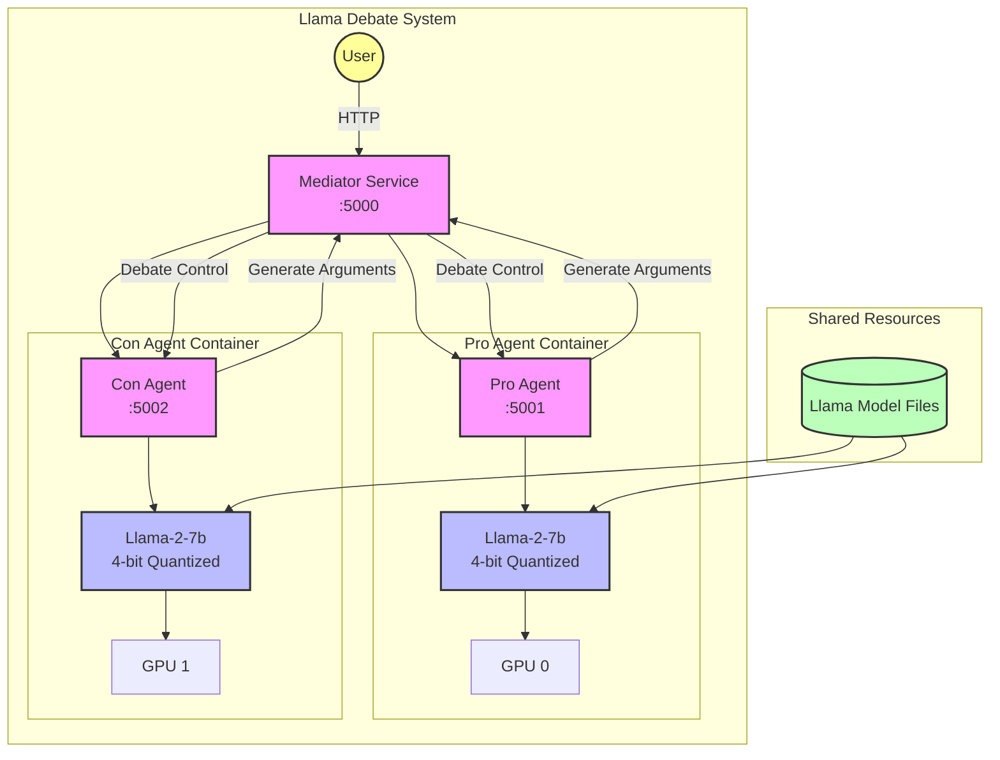

# Llama Debate Project

## 프로젝트 개요
이 프로젝트는 Llama-2-7b 모델을 활용하여 AI 에이전트들 간의 토론을 구현한 시스템입니다. 찬성(Pro)과 반대(Con) 입장의 에이전트들이 특정 주제에 대해 토론을 진행하며, 중재자(Mediator)가 토론을 조율합니다.

## 시스템 구조


## 시스템 요구사항
- NVIDIA GPU (CUDA 12.1 지원)
- Docker 및 Docker Compose
- 최소 32GB RAM (각 서비스당 8-16GB 필요)
- NVIDIA Container Toolkit

## 환경 설정
1. Llama-2-7b-hf 모델 파일을 `models` 디렉토리에 다운로드
2. 환경 변수 설정
```bash
cp .env.example .env
# .env 파일을 적절히 수정
```

## 실행 방법
1. 도커 컨테이너 빌드 및 실행
```bash
docker-compose up --build
```

2. 서비스 접근
- 중재자 서비스: http://localhost:5000
- 찬성 에이전트: http://localhost:5001
- 반대 에이전트: http://localhost:5002

## 메인 코드 직접 실행 방법
도커 없이 프로젝트의 각 컴포넌트를 직접 실행하려면 다음 단계를 따르세요:

### 1. 환경 준비
```bash
# 필요한 패키지 설치
pip install -r agent_pro/requirements.txt
pip install -r agent_con/requirements.txt
pip install -r mediator/requirements.txt
```

### 2. 각 서비스 실행
각 서비스는 별도의 터미널에서 실행해야 합니다.

#### 중재자 서비스 실행
```bash
cd mediator
python agent/entrypoint.py
```

#### 찬성 에이전트 실행
```bash
cd agent_pro
python agent/entrypoint.py
```

#### 반대 에이전트 실행
```bash
cd agent_con
python agent/entrypoint.py
```

### 3. 토론 시작
모든 서비스가 실행된 후, 중재자 서비스에 접속하여 토론 주제를 설정하고 토론을 시작할 수 있습니다:
- 접속 주소: http://localhost:5000

## 메인 토론 진행 방법

### 토론 세션 시작하기
1. 모든 서비스(중재자, 찬성 에이전트, 반대 에이전트)가 실행되고 있는지 확인합니다.
2. 웹 브라우저를 열고 중재자 서비스(http://localhost:5000)에 접속합니다.
3. 메인 페이지에서 토론 주제를 입력합니다. (예: "인공지능이 인류에게 위협이 될 것인가?")
4. "토론 시작" 버튼을 클릭하여 세션을 시작합니다.

### 토론 라운드 진행
토론은 기본적으로 다음과 같은 구조로 진행됩니다:
1. 중재자의 토론 주제 소개와 규칙 설명
2. 찬성 측 첫 발언 (서론)
3. 반대 측 첫 발언 (서론)
4. 찬성 측 반론 및 주장
5. 반대 측 반론 및 주장
6. (토론 라운드 반복)
7. 찬성 측 결론
8. 반대 측 결론
9. 중재자의 토론 총평 및 마무리

### 토론 중재 및 관리
- **라운드 제어**: 각 라운드는 "다음 라운드" 버튼을 클릭하여 진행됩니다.
- **타이머 관리**: 각 에이전트 발언에는 기본 제한 시간이 설정되어 있으며, 필요시 타이머 조정이 가능합니다.
- **토론 일시 중지**: "일시 중지" 버튼을 사용하여 토론을 잠시 중단할 수 있습니다.
- **토론 기록**: 모든 토론 내용은 자동으로 기록되며, 세션 종료 후 다운로드할 수 있습니다.

### 토론 설정 커스터마이징
웹 인터페이스의 설정 메뉴에서 다음 항목을 조정할 수 있습니다:
- 라운드 수
- 발언 제한 시간
- 발언 최대 글자 수
- AI 모델 온도(temperature) 설정
- 토론 스타일 및 형식

### 토론 결과 저장 및 분석
1. 토론 종료 후 "결과 저장" 버튼을 클릭하여 전체 토론 내용을 JSON 또는 텍스트 형식으로 저장할 수 있습니다.
2. 저장된 토론 기록은 분석 도구를 사용하여 논증 구조, 키워드 빈도 등을 시각화할 수 있습니다.

### 주의사항
- 모든 에이전트 서비스가 정상적으로 작동 중이어야 완전한 토론이 가능합니다.
- GPU 메모리 사용량이 높으므로, 다른 메모리 집약적인 애플리케이션을 동시에 실행하지 않는 것이 좋습니다.
- 장시간 토론 시 시스템 안정성을 위해 주기적으로 서비스를 재시작하는 것을 권장합니다.

## 주요 기능
- 각 에이전트(Pro/Con)는 독립적인 Llama-2-7b 모델을 사용
- 실시간 토론 진행 및 중재
- 자동 건강 체크 및 복구 기능
- GPU 가속을 통한 고성능 추론

## 기술 스택
- Python Flask 웹 프레임워크
- PyTorch (CUDA 12.1)
- Transformers 라이브러리
- Docker 컨테이너화
- NVIDIA GPU 지원

## 시스템 요구사항 (Python 패키지)
```
flask>=2.0.1,<2.1.0
werkzeug>=2.0.3,<2.1.0
requests>=2.26.0,<2.27.0
transformers>=4.35.0,<4.36.0
torch==2.1.0+cu121
accelerate>=0.24.0,<0.25.0
bitsandbytes>=0.41.1,<0.42.0
```

## 리소스 할당
각 서비스(agent_pro, agent_con, mediator)는 다음과 같은 리소스 제한이 설정되어 있습니다:
- CPU: 최대 1.0 코어 (최소 0.5 코어 예약)
- 메모리: 최대 16GB (최소 8GB 예약)
- GPU: agent_pro와 agent_con 각각 1개의 GPU 사용

## 실질적인 코드 확인 및 토론 시스템 직접 실행하기

### 코드 확인
각 서비스의 핵심 코드는 다음 파일에서 확인할 수 있습니다:
```
agent_pro/agent/entrypoint.py  # 찬성 에이전트 코드
agent_con/agent/entrypoint.py  # 반대 에이전트 코드
mediator/agent/entrypoint.py   # 중재자 서비스 코드
```

### API를 통한 토론 시작
토론 시스템이 실행된 후에는 HTTP 요청을 사용해 직접 토론을 시작할 수 있습니다:

```bash
curl -X POST http://localhost:5000/debate/start \
  -H "Content-Type: application/json" \
  -d '{
    "topic": "인공지능이 인류에게 위협이 될 것인가?",
    "context": "이것은 인공지능의 위험성에 대한 토론입니다.",
    "rounds": 3
  }'
```

이 API 요청 매개변수는 다음과 같습니다:
- `topic`: 토론할 주제 (필수)
- `context`: 토론에 대한 배경 정보 (선택적)
- `rounds`: 토론 라운드 수 (선택적, 기본값: 1)

응답으로는 전체 토론 결과가 JSON 형식으로 반환됩니다. 각 라운드별 찬성 측과 반대 측 주장이 포함됩니다.

### 로컬 개발 환경에서 실행하기
로컬 개발 환경에서는 기본 URL을 localhost로 조정해야 합니다. mediator/agent/entrypoint.py 파일에서 다음 부분을 수정하세요:

```python
# 원본 코드
AGENT_PRO_URL = "http://agent_pro:5000"
AGENT_CON_URL = "http://agent_con:5000"

# 로컬 환경을 위한 수정
AGENT_PRO_URL = "http://localhost:5001"  # agent_pro 서비스의 로컬 포트
AGENT_CON_URL = "http://localhost:5002"  # agent_con 서비스의 로컬 포트
```

### 각 서비스 포트 설정
로컬에서 실행할 때는 각 서비스의 포트를 다르게 설정하세요:
```bash
# 중재자 서비스 실행 (포트 5000)
cd mediator
python agent/entrypoint.py

# 찬성 에이전트 실행 (포트 5001)
cd agent_pro
export FLASK_RUN_PORT=5001  # Windows에서는 set FLASK_RUN_PORT=5001
python agent/entrypoint.py

# 반대 에이전트 실행 (포트 5002)
cd agent_con
export FLASK_RUN_PORT=5002  # Windows에서는 set FLASK_RUN_PORT=5002
python agent/entrypoint.py
```

### 토론 결과 예시
토론이 완료되면 다음과 같은 JSON 구조의 결과가 반환됩니다:

```json
{
  "topic": "인공지능이 인류에게 위협이 될 것인가?",
  "context": "이것은 인공지능의 위험성에 대한 토론입니다.",
  "rounds": 3,
  "debate_history": [
    {
      "round": 1,
      "pro_argument": "찬성 측의 첫 번째 논거...",
      "con_argument": "반대 측의 첫 번째 논거..."
    },
    {
      "round": 2,
      "pro_argument": "찬성 측의 두 번째 논거...",
      "con_argument": "반대 측의 두 번째 논거..."
    },
    {
      "round": 3,
      "pro_argument": "찬성 측의 세 번째 논거...",
      "con_argument": "반대 측의 세 번째 논거..."
    }
  ],
  "status": "completed"
}
```